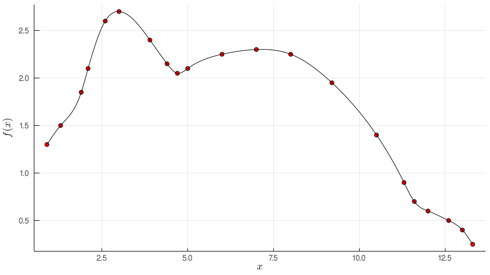

# Cubic Spline Interpolation

Execution of the code is detailed in:

    julia NaturalCubicSpline.jl -h
    usage: NaturalCubicSpline.jl [-D DELIMETER] [-h] File

    positional arguments:
        File                Name (and subroute) of the x, y file.

    optional arguments:
        -D, --Delimeter     Data Delimiter (',' '\t' ' ' etc.) (default: ",")
        -h, --help          Show this help message and exit

#

    

    

